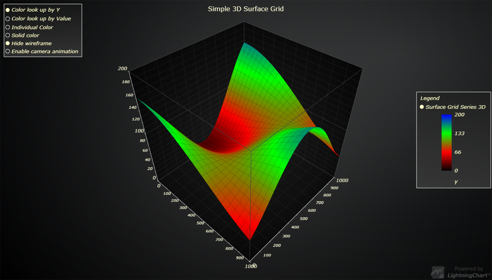

# JavaScript 3D Simple Surface Grid



This demo application belongs to the set of examples for LightningChart JS, data visualization library for JavaScript.

LightningChart JS is entirely GPU accelerated and performance optimized charting library for presenting massive amounts of data. It offers an easy way of creating sophisticated and interactive charts and adding them to your website or web application.

The demo can be used as an example or a seed project. Local execution requires the following steps:

- Make sure that relevant version of [Node.js](https://nodejs.org/en/download/) is installed
- Open the project folder in a terminal:

        npm install              # fetches dependencies
        npm start                # builds an application and starts the development server

- The application is available at *http://localhost:8080* in your browser, webpack-dev-server provides hot reload functionality.


## Description

This example shows an animated 3D grid surface with various different dynamic styles selectable from the User Interface.

The Chart is rendered using `SurfaceGridSeries3D`, a series type that renders a grid of XZ coordinates with varying Y and Color values.

## SurfaceGridSeries3D data format

`SurfaceGridSeries3D` stores 3 kinds of user modifiable data.
Each type of data has its own invalidation method. All these methods can be called either with:
- callback function.
    * Called back for each XZ coordinate of the grid.
    * Function then returns the value to be associated with the XZ coordinate.

- data matrix.
    * Multidimensional array of data values. 

It is also possible to not invalidate the whole grid, but only a section of it. This is done by appending a second parameter, which specifies the range of modification (`GridRangeOptions`).

```typescript
// Invalidate first row of Colors by callback.
SurfaceGridSeries3D.invalidateColorsOnly(
    ( row, column, prev ) => new ColorHSV( column * 10 ),
    {
        row: { start: 0, end: 1 },
        column: { start: 0, end: numberOfColumns }
    }
)
```

### Height map

Each XZ coordinate on the grid is associated with a Y coordinate (`Number`).

Y coordinates are invalidated with `SurfaceGridSeries3D.invalidateYOnly`
```typescript
// Invalidate full grids Y coordinates by callback.
SurfaceGridSeries3D.invalidateYOnly(
    ( row, column ) => Math.sin( row / 10 ) * Math.cos( column / 5 )
)
```

### Look-Up-Value map

Each XZ coordinate on the grid can be associated with a numeric look-up value (`Number`).

This can be used to dynamically color each grid coordinate based on an attached Color look-up table (`LUT`).
Note that coloring by the look-up values needs to be enabled by setting the Series' *FillStyle* as `PalettedFill`.

Look-Up-Values are invalidated with  `SurfaceGridSeries3D.invalidateValuesOnly`
```typescript
// Define Color Look-Up-Table.
const lut = new LUT( {
    steps: [
        { value: 0, color: ColorRGBA( 0, 0, 0 ) },
        { value: 50, color: ColorRGBA( 255, 0, 0 ) }
    ],
    interpolate: true
} )

// Invalidate a 5x5 grids Look-Up-Values by data matrix.
SurfaceGridSeries3D.invalidateValuesOnly(
    [
        // First row.
        [0,0,0,0,0],
        // Second row.
        [10,10,10,10,10],
        // and so forth...
        [20,20,20,20,20],
        [30,30,30,30,30],
        [40,40,40,40,40],
    ]
)

// Configure Series fill style as look up from table.
SurfaceGridSeries3D.setFillStyle( new PalettedFill({ lut }) )
```

### Color map

Each XZ coordinate on the grid can be associated with a `Color`.

This can be used to color each grid coordinate with its own Color.
Note that coloring by the individual Colors needs to be enabled by setting the Series' *FillStyle* as `IndividualPointFill`.

Color values are invalidated with  `SurfaceGridSeries3D.invalidateColorsOnly`
```typescript
// Invalidate first row of Colors by callback.
SurfaceGridSeries3D.invalidateColorsOnly(
    ( row, column, prev ) => new ColorHSV( column * 10 ),
    {
        row: { start: 0, end: 1 },
        column: { start: 0, end: numberOfColumns }
    }
)

// Configure Series fill style as individual colors.
SurfaceGridSeries3D.setFillStyle( new IndividualPointFill() )
```


## API Links

* [3D chart]
* [3D surface grid series]
* [Grid range options]
* [Paletted Fill Style]
* [LUT]


## Support

If you notice an error in the example code, please open an issue on [GitHub][0] repository of the entire example.

Official [API documentation][1] can be found on [Arction][2] website.

If the docs and other materials do not solve your problem as well as implementation help is needed, ask on [StackOverflow][3] (tagged lightningchart).

If you think you found a bug in the LightningChart JavaScript library, please contact support@arction.com.

Direct developer email support can be purchased through a [Support Plan][4] or by contacting sales@arction.com.

[0]: https://github.com/Arction/
[1]: https://www.arction.com/lightningchart-js-api-documentation/
[2]: https://www.arction.com
[3]: https://stackoverflow.com/questions/tagged/lightningchart
[4]: https://www.arction.com/support-services/

© Arction Ltd 2009-2020. All rights reserved.


[3D chart]: https://www.arction.com/lightningchart-js-api-documentation/v3.1.0/classes/chart3d.html
[3D surface grid series]: https://www.arction.com/lightningchart-js-api-documentation/v3.1.0/classes/surfacegridseries3d.html
[Grid range options]: https://www.arction.com/lightningchart-js-api-documentation/v3.1.0/interfaces/gridrangeoptions.html
[Paletted Fill Style]: https://www.arction.com/lightningchart-js-api-documentation/v3.1.0/classes/palettedfill.html
[LUT]: https://www.arction.com/lightningchart-js-api-documentation/v3.1.0/classes/lut.html

